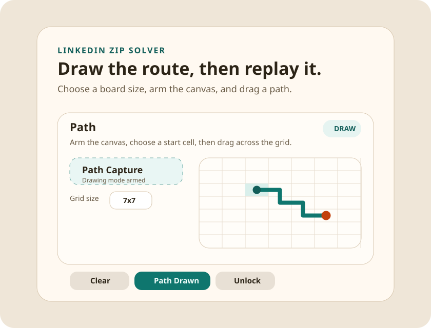
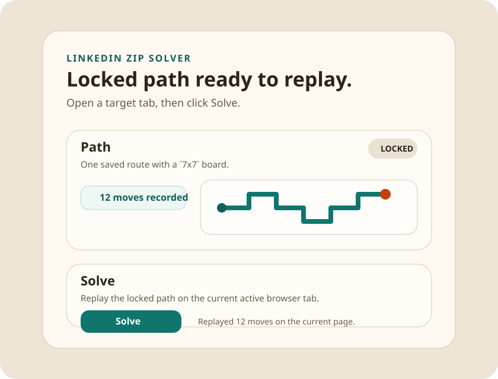

# LinkedIn ZIP Solver

A Chrome extension for drawing a route in the popup and replaying it as arrow-key input on the active tab.

## Overview

This project started as a LinkedIn ZIP game helper and currently supports a broader test mode so you can validate the path replay flow on any normal `http` or `https` page.

The popup lets you:

- choose a grid size from presets or enter a custom size from `3x3` to `25x25`
- click `Path Capture`
- pick a starting cell
- drag cell-by-cell to draw a path
- lock the path with `Path Drawn`
- replay the saved moves with `Solve`

Or skip drawing entirely: click `Use today's answer` to load and lock the current LinkedIn ZIP solution from [zipgameonline.com/linkedin-zip-answers](https://www.zipgameonline.com/linkedin-zip-answers). The popup picks up the published grid size and start cell automatically.

Tip: the included `test-page.html` is the quickest way to verify the replay visually while tuning paths and board sizes.

## Screenshots

### Drawing a path



### Locked path ready to solve



## Project Files

- `manifest.json`: Manifest V3 config and permissions
- `popup.html`: extension popup markup
- `popup.css`: popup styling
- `popup.js`: popup state, drawing UI, storage, and solve trigger
- `content.js`: page-side keyboard replay logic used for compatibility testing
- `test-page.html`: local visual test harness for replay verification
- `test-page.css`: styling for the test harness board and timer
- `test-page.js`: timer, board rendering, and arrow-key replay visualization

## How It Works

1. Open the extension popup.
2. Pick a grid size.
3. Click `Path Capture`.
4. Click a grid cell to set the start.
5. Drag through adjacent cells to record the route.
6. Click `Path Drawn` to lock and save it.
7. Open the target page and click `Solve`.

### Auto-fill from zipgameonline.com

Instead of steps 2–6, click `Use today's answer`. The popup fetches the answers page, extracts the SVG polyline for today's puzzle, and converts it into the same `{startPoint, moves, gridSize}` shape used by manual capture. The route lands locked, so you can go straight to `Solve`. If the page is unreachable or its markup changes, the feedback area surfaces the error and your previous path is left untouched until the auto-fill succeeds.

The extension stores one active path in `chrome.storage.local`:

```json
{
  "zipSolverPath": {
    "locked": true,
    "moves": ["ArrowUp", "ArrowRight", "ArrowRight"],
    "gridSize": 7,
    "startPoint": { "x": 3, "y": 3 }
  }
}
```

## Load in Chrome

1. Open `chrome://extensions`
2. Enable `Developer mode`
3. Click `Load unpacked`
4. Select this project folder

If you update the extension files:

1. Click `Reload` on the extension card
2. Refresh the tab you want to test

## Local Test Page

To test the extension against a page you control, serve this repo locally and open the included harness page:

```bash
python3 -m http.server 8000
```

Then visit:

```text
http://localhost:8000/test-page.html
```

The test page:

- draws a live grid
- starts a timer as soon as the page loads
- listens for replayed arrow-key input
- syncs to the extension's chosen grid size and start point when you click `Solve`
- shows the path as it is drawn on the board

## Testing Notes

- The extension now supports testing on any regular website tab.
- Some pages ignore synthetic keyboard events. When that happens, the popup may report `Unsupported`.
- Keyboard tester pages are useful for checking whether replay runs at all, but many only respond to trusted physical key presses.

## Current Scope

- one saved path at a time
- mouse-based path drawing
- one-click auto-fill of today's solution from zipgameonline.com
- configurable grid size
- popup-based workflow only
- replay through synthetic arrow-key events
